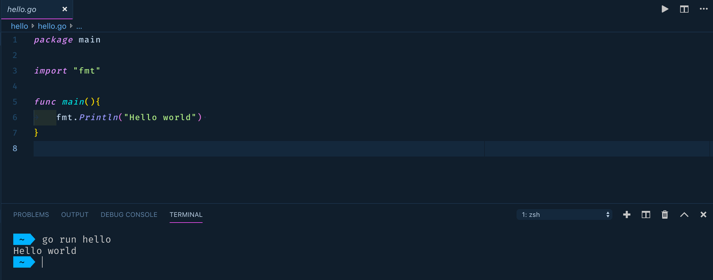

## 1.INTRO 
#### 1.1 Tổng quan về GO ? 
 Có một bài toán đau đầu dành cho các công ty là khi họ đã lên tới tầng scale cho một dự án. Thời gian đầu thì sẽ là optimize code, database, scale phần cứng… nhưng khi tới một lượng user cực lớn thì vấn đề đó sẽ càng ngày càng nan giải. Và giải pháp của một số công ty đó là chọn Go. Nó được thiết kế để có thể scale một hệ thống với số request lớn, có thể lên tới hàng triệu request/s. Thêm một lí do nữa là Go là một ngôn ngữ đơn giản, learning curve thuộc dạng dễ nhất trong các ngôn ngữ, vì thế chi phí để chuyển qua Go thấp. Ngoài ra còn một số tiêu chí: build time nhanh, chuẩn hóa code giữa các thành viên trong team bằng vô số tool xịn…
 Ngày nay khi phần cứng ngày càng phát triển, CPU đa nhân thì các ngôn ngữ theo concurrency model sẽ là xu hướng. Go là một trong số đó. Go không phải là một ngôn ngữ mạnh tuyệt đối. Concurrency Go sẽ không bằng Erlang, Clojure, về mức độ strong typed thì lại càng không thể so sánh với các ngôn ngữ functional như Haskell, Scala, về việc làm prototype nhanh thì không thể bằng Ruby hay Node. Nhưng lí do mọi người thích Go là vì nó support ở mức “vừa đủ xài” hay theo mọi người vẫn hay nói là “simple enough to build the world”.
#### 1.2 Nguyên lý thiết kế GO 
  Golang có cú pháp giống với C/C++, được phát triển tại Google năm 2007. Được sử dụng trong một số hệ thống sản phầm của Google. Nếu ai đã từng học qua C or C++ thì sẽ làm quen rất nhanh với GoLang.
    
    - Nguyên lý thiết kế Golang
     + Thời gian biên dịch nhanh
    
     + Hỗ trợ xử lý đồng thời: gorountines, channels,
    
     + Nhất quán, đơn giản, an toàn
    
     + Hỗ trợ Interface và Type Một số đặc trưng của Golang Method: 
       Golang không có classes, nhưng nó cho phép định nghĩa method dựa trên 
       các kiểu dữ liệu tự đinh nghĩa. Intefaces: định nghĩa tập hợp các phương thức sẽ thực thi.
    
     + Kiểu con trỏ - pointer: lưu địa chỉ bộ nhớ của biến
    
     + Xử lý đồng thời – concurrency: goroutine quản lý thread trong Go runtime, 
     goroutine giao tiếp với nhau thông qua channel.
     
Example: Hello World
     package main
     
     import "fmt"
     
     func main() {
        fmt.Println("Hello, World!")
     }
##### Tham khảo thêm 
Có thể tham khảo thêm tại: https://golang.org/doc/code.html Hoặc : https://www.tutorialspoint.com/go/go_basic_syntax.htm.
## 2. Những đặc điểm chính của GO 
    Go là ngôn ngữ statically typed.
    Go có sẵn một bộ Garbage collection và Memory safety.
    Chuỗi kí tự trong Go đều được mặc định encode về UTF-8.
    Có cú pháp cực kì đơn giản.
#### 2.1 Hướng dẫn cài đặt
    Có thể download golang và cài đặt tại: https://golang.org/dl/ 
#### 2.2 GO PATH , Go workspace 
    Ở version trước 1.11 thì Go ràng buộc chúng ta thư mục tổ chức để lưu giữ các đoạna code 
    - Toàn bộ Go code và package bạn import phải nằm trong một workspace. Một workspace là một thư 
    mục trong hệ thống mà đường dẫn là một biến môi trường tên là GOPATH.
    
    Thư mục workspace sẽ chứa những thư mục con như sau:
    
    src: 
    
    Nơi đây sẽ chứa toàn bộ source code chương trình Go.
    
    bin: 
    
    Nơi đây sẽ chứa mã nhị phân là những đoạn code Go từ src được compile.
    
    pkg: 
    
    Nơi đây sẽ chứa các package mà ta sẽ import và sử dụng trong nhưng đoạn code Go trong thư mục src.
    
Trong GO, để import một thư viện hoặc 1 package ta sử dụng:
`import "tên package"` hoặc  `import "main/<tên package con>"`

Để chạy được chương trình Hello world ở ví dụ trên, cách đơn giản là ta sử dụng lệnh 
`go run main.go `

Ngoài ra bạn có thể build code GO của bạn thành mã nhị phân bằng câu lệnh `go build` 

    $ cd $GOPATH/src/hello
    $ go build
    $ ./hello
    Hello world
    
Với version lớn 1.11, bạn có thể xây dựng ứng dụng Go của mình bên ngoài GOPATH. 

Trong version 1.11, khi bạn đặt mã nguồn bên trong $GOPATH, nó bỏ qua tính năng của modules và sử dụng GOPATH cho tìm kiếm các phụ thuộc mã nguồn. Tuy nhiên, nếu bạn đặt mã nguồn bên ngoài GOPATH, hỗ trợ modules được bật tự động. 

Điều này có nghĩa là, bạn có thể xây dựng ứng dụng của mình từ nhiều thư viện mà bạn muốn!

## 3. Go Package
Ta có coi một package là một gói các đoạn code, giúp bạn tổ chức chương trình của bạn. Nó giúp bạn có thể gói một hoặc nhiều file source code vào một file duy nhất và có thể sử dụng lại

Bạn có thể coi một package trong Go như một namespaces trong các ngôn ngữ khác. Điểm duy nhất khác biệt là sẽ không có các Package con, và các package sẽ nhỏ và nhiều.

Tất cả source code đều phải nằm trong một package
Chương trình của Go được cấu tạo bởi một hoặc nhiều package.

**Single concept**

Ta chỉ bỏ nhưng đoạn code liên quan vào trong package và phải đặt tên pacakge theo đúng chuẩn. Bạn có thể đọc guide cách đặt tên package tại đây https://blog.golang.org/package-names.

Có thể chưa không hoặc nhiều function và state

Package trong go có thể chỉ cần chứa duy nhất một function như tỉnh tổng 2 số. Package không nhất thiết phải to như các ngôn ngữ khác.

**Tái sử dụng**

Ta có thể export function và data từ một pacakge khác.

**Import duy nhất một lần**

Bạn có thể import một package trong nhiều package khác, và nó sẽ chỉ được import duy nhất một lần mà thôi.

## 4. Go concurrency, Channel 
Một câu hỏi đặt ra là tại sao sử dụng GO: 
- Một trong những điểm nổi bậc của go là gorouting. 
- Code trong go rất dễ maintain vì 
    + Nó không có classes: Mọi thứ trong Go được đóng gói bằng package, và go chỉ có struct thay vì class.
- Dễ học.
- Biên dịch ra nhiều nền tảng: bạn có thể build trên Unix, Linux, Windows sau khi biên dịch, chỉ cần 1 file duy nhất, copy đến hệ điều hành đích là chạy, rất đơn giản
#### 4.1 Go concurrency 
Cocurrency là tính năng chủ lực của ngôn ngữ lập trình Go để tận dụng năng lực xử lý của CPU. Thông thường các ngôn ngữ lâp trình khác phải phụ thuộc sự cấp phát tài nguyên của hệ điều hành để có thể chạy Concurrency, trong khi đó Go có thể chạy concurrency mà không phụ thuộc hệ điều hành. Concurrency gần giống với thread, trong Go thì việc giao tiếp giữa các goroutine khá đơn giản với channel, có thể truyền dữ liệu giữa các goroutine với nhau bằng bất cứ loại dữ liệu nào.

Vậy làm thế nào để 1 máy tính có CPU 1 nhân có thể xử lí nhiều tác vụ cùng lúc, trong khi 1 nhân CPU chỉ có thể xử lí 1 việc tại 1 thời điểm? Concurrency tức là xử lí 1 tác vụ tại 1 thời điểm, nhưng CPU không xử lí hết 1 tác vụ rồi mới đến tác vụ khác, mà sẽ dành 1 lúc cho tác vụ này, 1 lúc cho tác vụ kia. Do vậy, chúng ta có cảm giác máy tính thực hiện nhiều tác vụ cùng 1 lúc, nhưng thực chất chỉ có 1 tác vụ được xử lí tại 1 thời điểm.
Cùng xem biểu đồ dưới để rõ hơn về cách CPU phân bố khi chúng ta sử dựng web ở ví dụ trên

     
Từ biểu đồ trên, chúng ta có thể thấy rằng, CPU 1 nhân phân chia thời gian làm việc dựa trên độ ưu tiên của cùng tác vụ. Ví dụ, khi đang scroll trang, việc nghe nhạc sẽ có độ ưu tiên thấp hơn, nên có thể nhạc của bạn sẽ bị dừng do đường truyền kém, nhưng bạn vẫn có thể kéo trang lên xuống.

Cách sử dụng go routing cũng rất dễ bằng cách đặt keyword `go` trước key `func`

Example : 
        
        func main() {
        	links := []string{
        		"http://google.com",
        		"http://facebook.com",
        		"http://stackoverflow.com",
        		"http://golang.org",
        		"http://amazon.com",
        	}
        
        	c := make(chan string)
        
        	for _, link := range links {
        		go checkLink(link, c)
        	}
        
        	for l := range c {
        		go func(link string) {
        			time.Sleep(5 * time.Second)
        			checkLink(link, c)
        		}(l)
        	}
        }

#### 4.2 Channels
`Channels` đóng vai trò quan trọng khi sử dụng goroutines. Chúng giúp ngăn ngừa race condition và việc truy cập không đúng đến các dữ liệu được chia sẻ.
**_Example**_ :

    func checkLink(link string, c chan string) {
     	_, err := http.Get(link)
     	if err != nil {
     		fmt.Println(link, "might be down!")
     		c <- link
     		return
     	}
     
     	fmt.Println(link, "is up!")
     	c <- link
     }